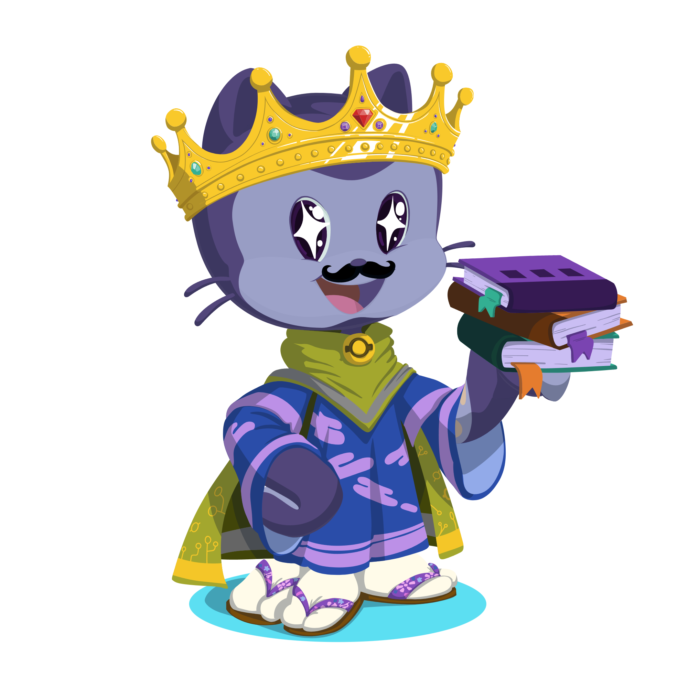

<h1 align="center">Gabriel Mendes | OMGItsGM</h1>
<h2 align="center">Welcome to my Github profile 😀❤️</h2>

  <!-- Github Stats -->
  

  <!-- Most used Languages -->
  

<h2 align="center">💬 About me</h2>

My name is Gabriel, I'm 23 years old and I love to use programming to create new things and to solve problems.

I am currently doing a bachelor's degree in Computer Science (7/8) at _Universidade Presbiteriana Mackenzie_.

Here on my Github you will find my most recent personal projects and will discover what technologies I'm currently studying.

I hope you enjoy it!

---

  <h2>💻 Technologies</h2>

  
  <!--  -->
  
  
  
  
  
  

---

  <h2> 📱 Social</h2>
  

